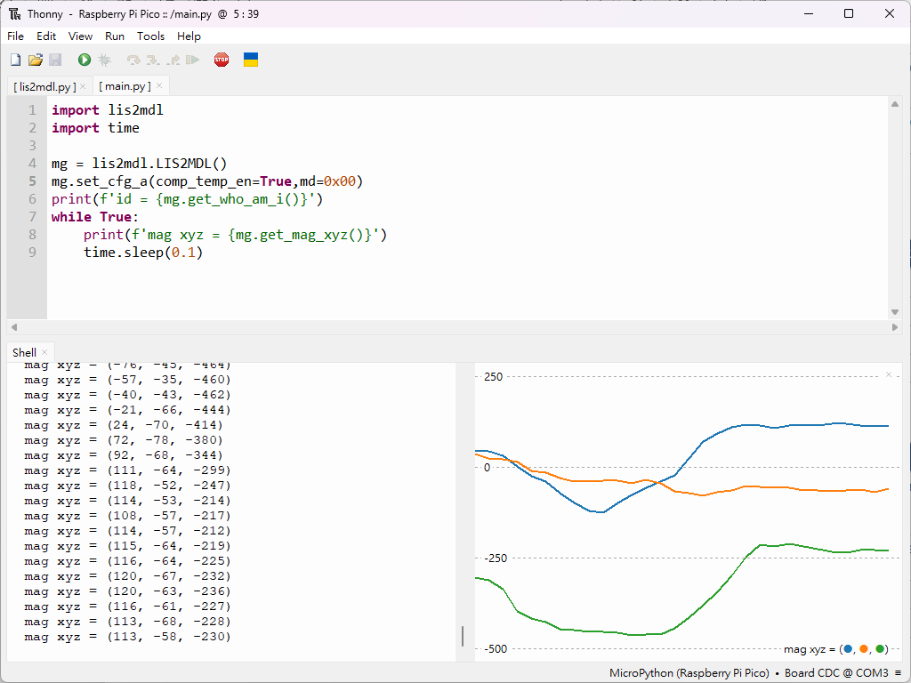

# LIS2MDL 3-Axis Magnetometer and Raspberry Pi Pico

The LIS2MDL is a high-performance, low-power 3-axis magnetometer from STMicroelectronics. It is designed for accurate magnetic field measurement and heading determination. The sensor communicates via I²C (up to 3.4 MHz), making it easy to interface with Raspberry Pi Pico or other microcontrollers.
<br>

## LIS2MDL Module

To test the LIS2MDL driver, we use the Adafruit Triple-axis Magnetometer LIS2MDL module. Here found it.
<br>

## Pin Connection

| Raspberry Pi Pico W |     | LIS2MDL Module |
| :------------------ | :-: | -------------: |
| VBUS                |  →  |            VCC |
| GND                 |  →  |            GND |
| GP16                |  →  |            SDA |
| GP17                |  →  |            SCL |

<br>

## Installing

This project uses **MicroPython**, so you must first flash MicroPython firmware to the Raspberry Pi Pico.
Visit the official Raspberry Pi documentation [**here**](https://www.raspberrypi.com/documentation/microcontrollers/micropython.html) for detailed setup instructions.

<br>

## Thonny

We use **Thonny** as the development environment. Download it from [**here**](https://thonny.org/).

<br>

## Quick Start

Save the driver file [**lis2mdl.py**](./lis2mdl.py) and your application [**main.py**](./main.py) to the Raspberry Pi Pico.

Run `main.py`, and the output will show the magnetic field values of **X, Y, Z** axes in real time.
You may enable **View → Plotter** in Thonny to visualize the changing magnetic field.




<br>

## Class LIS2MDL

### Constructor

```
class lis2mdl.LIS2MDL( [i2c_addr = 0x1E],
                       [i2c_id = 0],
                       [scl_pin = 17],
                       [sda_pin = 16] )
```

Construct a new LIS2MDL object with the following parameters:

* **i2c_addr** – I²C address of the LIS2MDL (default 0x1E)
* **i2c_id** – I²C controller index of Raspberry Pi Pico (default 0)
* **scl_pin** – I²C SCL pin number
* **sda_pin** – I²C SDA pin number

<br>


## Reference
* ST LIS2MDL Datasheet
  [https://www.st.com/en/mems-and-sensors/lis2mdl.html](https://www.st.com/en/mems-and-sensors/lis2mdl.html)
* Raspberry Pi Pico
  [https://www.raspberrypi.com/products/raspberry-pi-pico/](https://www.raspberrypi.com/products/raspberry-pi-pico/)
* MicroPython I²C
  [https://docs.micropython.org/en/latest/library/machine.I2C.html](https://docs.micropython.org/en/latest/library/machine.I2C.html)

<br>

## License

Licensed under Creative Commons Attribution **CC BY-NC-SA**.
